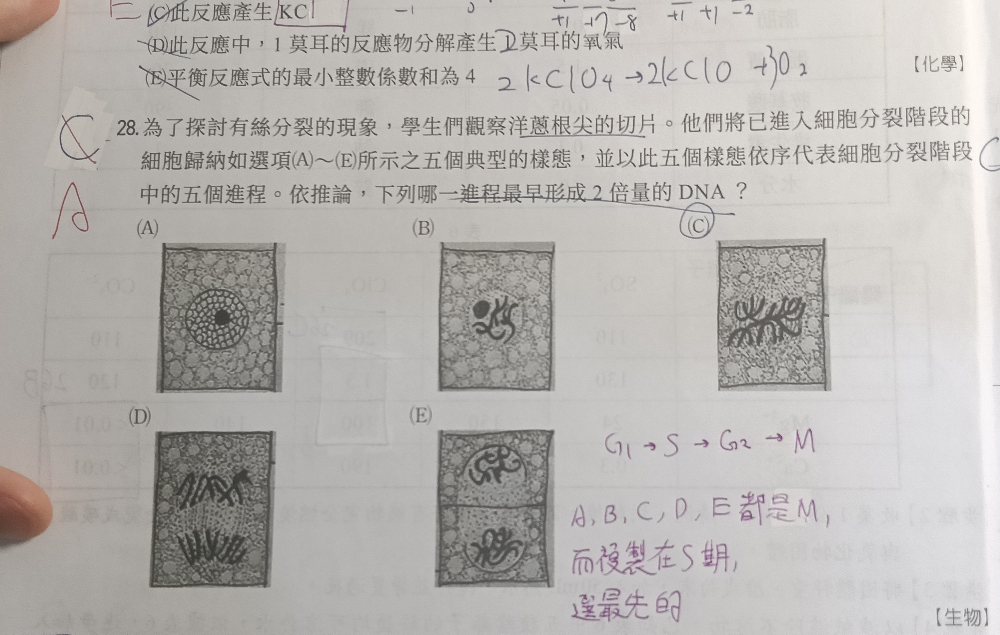

# bio-007

## 題目

為了探討有絲分裂的現象，學生們觀察洋蔥根尖的切片。他們將已進入細胞分裂階段的細胞歸納如選項 (A)～(E) 所示之五個典型的樣態，並以此五個樣態依序代表細胞分裂階段中的五個進程。依推論，下列哪一進程最早形成 2 倍量的 DNA？

## 解法

::: details

答案為 **(A)**。

DNA 的複製發生在細胞週期的間期 S 期，並在進入有絲分裂前完成，因此細胞在最早的間期就已形成 2 倍量的 DNA。

圖 (A) 中仍可見完整的細胞核與核仁，染色質尚未凝縮成清楚的染色體，屬於間期；其餘各圖則依序呈現染色體凝縮、排列、分離及形成兩個子細胞核等有絲分裂過程。因此五個進程中，最早具有 2 倍量 DNA 的是 (A)。

:::
