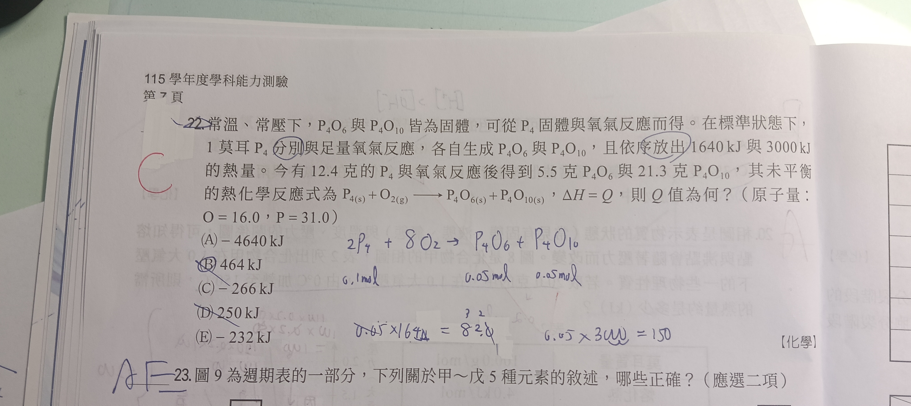

# che-006

## 題目

在常溫、常壓下，$\ce{P4O6}$ 與 $\ce{P4O10}$ 皆為固體，可從 $\ce{P4}$ 固體與氧氣反應而得。在標準狀態下，1 莫耳 $\ce{P4}$ 分別與足量氧氣反應，各自生成 $\ce{P4O6}$ 與 $\ce{P4O10}$，且依序放出 $1640\ \mathrm{kJ}$ 與 $3000\ \mathrm{kJ}$ 的熱量。今有 $12.4$ 克的 $\ce{P4}$ 與氧氣反應後得到 $5.5$ 克 $\ce{P4O6}$ 與 $21.3$ 克 $\ce{P4O10}$，其未平衡的熱化學反應式為

$$
\ce{P4(s) + O2(g) -> P4O6(s) + P4O10(s)},\qquad \Delta H = Q
$$

則 $Q$ 值為何？（原子量：$\ce{O}=16.0$，$\ce{P}=31.0$）

- (A) $-4640\ \mathrm{kJ}$
- (B) $464\ \mathrm{kJ}$
- (C) $-266\ \mathrm{kJ}$
- (D) $250\ \mathrm{kJ}$
- (E) $-232\ \mathrm{kJ}$

## 解法

先計算兩種生成物的莫耳質量：

$$
M(\ce{P4O6})=4(31.0)+6(16.0)=220\ \mathrm{g\,mol^{-1}}
$$

$$
M(\ce{P4O10})=4(31.0)+10(16.0)=284\ \mathrm{g\,mol^{-1}}
$$

實際生成的莫耳數為

$$
n(\ce{P4O6})=\frac{5.5}{220}=0.025\ \mathrm{mol}
$$

$$
n(\ce{P4O10})=\frac{21.3}{284}=0.075\ \mathrm{mol}
$$

因此兩種生成物形成時放出的熱量總和為

$$
0.025(1640)+0.075(3000)=41+225=266\ \mathrm{kJ}
$$

反應放出熱量，故焓變為負值：

$$
Q=\Delta H=-266\ \mathrm{kJ}
$$

故選 **(C)**。
