# math-002

## 題目

如右圖，圓 $O$ 為正方形 $ABCD$ 的內切圓，以 $A$ 為圓心，$\overline{AB}$ 為半徑畫弧交圓 $O$ 於 $P$、$Q$ 兩點，求 $\angle PAQ$ 最接近＿＿度。

（$\cos 54^\circ \approx 0.59$，$\cos 56^\circ \approx 0.56$，$\cos 58^\circ \approx 0.53$，$\cos 62^\circ \approx 0.47$）

來源：臺南一中。

## 解法

::: details 解答

**答案：$56^\circ$。**

設內切圓半徑為 $1$，則正方形邊長為 $2$。連接 $AO$、$OP$，可得

$$
AP=2,\qquad OP=1,\qquad AO=\sqrt{2}.
$$

兩圓的交點 $P$、$Q$ 關於連心線 $AO$ 對稱，所以令 $\alpha=\angle PAO$，便有 $\angle PAQ=2\alpha$。

在 $\triangle AOP$ 中，由餘弦定理：

$$
\cos\alpha
=\frac{AP^2+AO^2-OP^2}{2\cdot AP\cdot AO}
=\frac{4+2-1}{4\sqrt{2}}
=\frac{5}{4\sqrt{2}}.
$$

直接套用餘弦二倍角公式：

$$
\cos\angle PAQ
=\cos 2\alpha
=2\cos^2\alpha-1
=2\cdot\frac{25}{32}-1
=\frac{9}{16}
=0.5625.
$$

因餘弦值在 $0^\circ$ 到 $180^\circ$ 間遞減，對照題目提供的數值，$\angle PAQ$ 最接近 $56^\circ$。

:::
