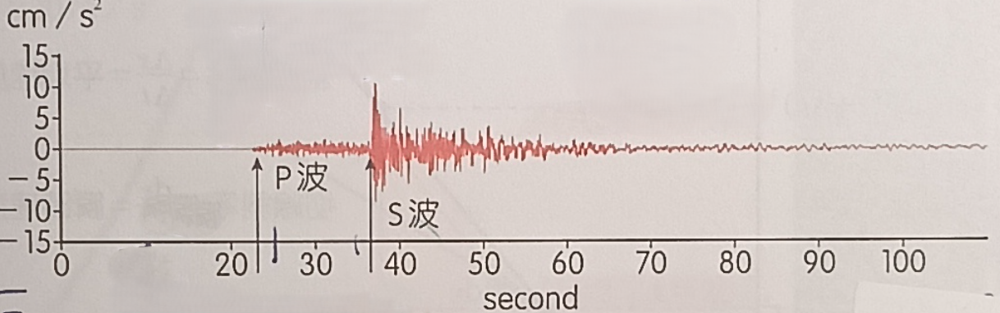

# phy-002

## 題目

地震預警是利用地震在地球內部傳播的 P 波與 S 波的速度差，透過偵測首先到達的 P 波來判斷地震規模，在振動強烈的 S 波到達前的時間內發出預警，以利後續應變。2021 年 2 月 7 日發生芮氏規模 $6.1$ 的地震，許多民眾手機收到多次國家級警報。該地震震源在臺灣東部外海，深度約為 $112\ \mathrm{km}$。宜蘭市地震監測站（距震源直線距離約為 $141\ \mathrm{km}$）測得地動加速度對時間的關係，如下圖所示，圖中第 $0\ \mathrm{s}$ 為地震起始時間。若宜蘭市預警系統可在 P 波抵達後的 $7\ \mathrm{s}$ 內就完成判斷並發出預警至各縣市，則對於距震源直線距離約 $215\ \mathrm{km}$ 的苗栗市，可提供的應變時間約為幾 $\mathrm{s}$？（假設 P 波與 S 波的波速固定，且都由震源直線傳播到地表上的各地點）

- (A) $7$
- (B) $14$
- (C) $26$
- (D) $33$
- (E) $37$

原題為照片第 1 題（含地動加速度圖）：

## 解法

::: details 解答與推導

**答案：(C)，約 $26\ \mathrm{s}$。**

由圖讀出宜蘭站的 P 波約在 $23\ \mathrm{s}$ 抵達，S 波約在 $37\ \mathrm{s}$ 抵達。因此預警發出的時刻為

$$
t_{\text{警報}}=23+7=30\ \mathrm{s}.
$$

S 波的波速固定，傳播時間與距震源的直線距離成正比，所以 S 波抵達苗栗的時刻為

$$
t_{\mathrm{S,苗栗}}=37\times\frac{215}{141}
\approx56.4\ \mathrm{s}.
$$

苗栗收到預警後，到 S 波抵達前的應變時間約為

$$
\Delta t=t_{\mathrm{S,苗栗}}-t_{\text{警報}}
=56.4-30=26.4\ \mathrm{s}
\approx\boxed{26\ \mathrm{s}}.
$$

此題以宜蘭偵測到 P 波的時刻決定發報時間，不能改用苗栗當地的 P、S 波抵達時間差。題目已給距震源的直線距離，不必再利用震源深度計算路程。

:::
