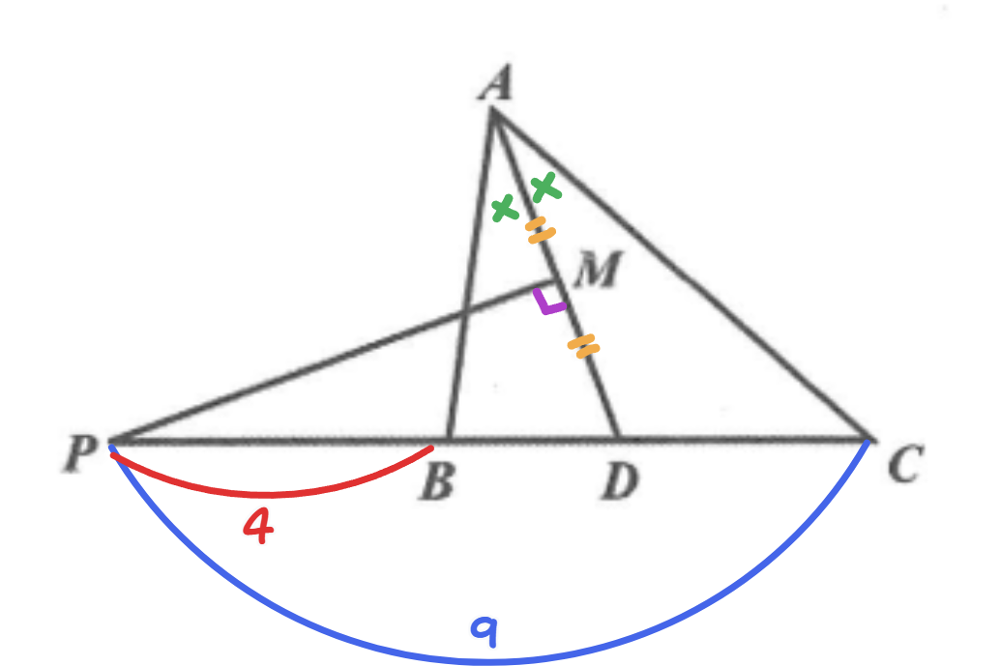
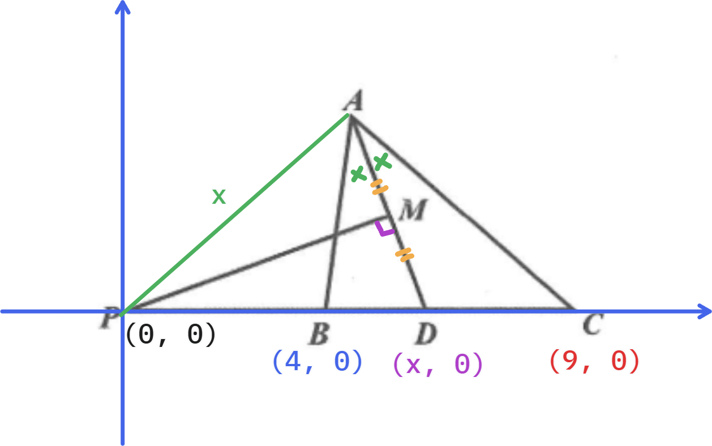

# TRML 2019 個人賽

## I1

> **[題目]**
> 若 $x$ 的二次方程式 $9x^2-3(1+a)x+a=0$ 的兩根為 $\sin\theta$、$\cos\theta$，則 $a^2=?$

若方程式兩根為 $\sin\theta$、$\cos\theta$，可以設方程式為 $k(x - \sin\theta)(x-\cos\theta)=0$。展開後對應如下：

$$
\begin{aligned}
k(x - \sin\theta)(x-\cos\theta)
&= kx^2 - k(\sin\theta + \cos\theta) + k\sin\theta\cos\theta
\end{aligned}
$$

由於原方程式 $9x^2-3(1+a)x+a=0$，$x^2$ 系數為 $9$，因此 $k = 9$ 帶入上式：

$$
\begin{aligned}
9x^2 - 9(\sin\theta + \cos\theta) + 9\sin\theta\cos\theta
\end{aligned}
$$

這時每項係數一一對應可知：

$$
\begin{cases}
-3(1+a) = -9(\sin\theta + \cos\theta) \\
a = 9\sin\theta\cos\theta
\end{cases}
$$

化簡可得：

$$
\begin{cases}
\sin\theta + \cos\theta = \frac{a + 1}{3}\\
a = 9\sin\theta\cos\theta
\end{cases}
$$

將第一式平方可得：

$$
\begin{aligned}
(\sin\theta + \cos\theta)^2
&= \sin^2\theta + \cos^2\theta + 2\sin\theta\cos\theta \\
(\frac{a + 1}{3})^2
&= 1 + \frac{2}{9}a
\end{aligned}
$$

化簡可得：

$$a^2 = 8$$

## I2

> **[題目]**
> 若 $t$ 為大於 $1$ 的實數,則 $\frac{t^4}{t^2 - 1}$ 的最小值為？

**[代數解]**

將 $t^4, t^2$ 代元變成 $x^2, x$， 因此原式轉為：

$$\min \frac{x^2}{x - 1} (x \in \mathbb{R} \wedge x > 1)$$

**注意到**，底下有 $x - 1$，那上面的 $x^2$ 可以看成 $[(x - 1) + 1]^2$。原式轉為：

$$\frac{[(x - 1) + 1]}{x - 1} = \frac{(x - 1)^2 + 1^2 + 2 (x - 1)}{x - 1} = (x - 1) + \frac{1}{x - 1} + 2$$

**注意到**，可以把 $x - 1$ 代元變成 $k$，於是原式轉為：

$$k + \frac{1}{k} - 2$$

而根據**算幾不等式**，可知：

$$\frac{k + \frac{1}{k}}{2} \ge \sqrt{k \times \frac{1}{k}}$$

因此：

$$\min{k + \frac{1}{k}} = 2 \Longrightarrow \min{k + \frac{1}{k} + 2} = 4$$

**[微分解]**

將 $t^4, t^2$ 代元變成 $x^2, x$， 因此原式轉為：

$$\min \frac{x^2}{x - 1} (x \in \mathbb{R} \wedge x > 1)$$

使用商數微分，也就是：

$$(\frac{u}{v})' = \frac{u'v - uv'}{v^2}$$

令 $f(x) = \frac{x^2}{x - 1} $，則：

$$
\begin{aligned}
f'(x)
&= \frac{(x^2)'(x - 1) - (x^2)(x - 1)'}{(x - 1)^2} \\
&= \frac{(2x)(x - 1) - (x^2)(1)}{(x - 1)^2} \\
&= \frac{2x^2 - 2x - x^2}{(x - 1)^2} \\
&= \frac{x^2 - 2x}{(x - 1)^2} \\
&= \frac{x(x - 2)}{(x - 1)^2}
\end{aligned}
$$

再來找 $f'(x) = 0$ 的 $x$，發現 $(x - 1)^2$ 必 $\ge 0$，所以只看 $x(x - 2) = 0$。

這時 $x = 0 \vee 2$，但由於題目限制，因此 $x = 2$，帶回原式：

$$f(2) = \frac{2^2}{x-1} = 4$$

## I3

三角形 $ABC$ 中，$\angle A=60\degree, B=47\degree$，且 $\overline{BC}=24$。若以 $\overline{BC}$ 為直徑作圓，交 $\overline{AB}$ 於 $D$、交 $\overline{AC}$ 於 $E$，則 $\overline{DE}=?$

做圖可知，

$\overline{CD}$ 相連後，$\angle BDC = 90\degree$，而 $\angle DCA = 30\degree$。

因此，優弧 $\overset{\frown}{DE}$ 的圓心角就是 $2\angle DCA = 60\degree$。

由於 $\overline{OD} = \overline{OE} = 2r$，因此三角形 $DOE$ 會是**正三角形**，因此 $\overline{DE} = r = 12$。

## I4

若七位數 $108\underline{abcd}$ 可以被 $2, 3, 5, 7, 11$ 整除，試求 $\max \underline{abcd}$？

由於此數可被多數整除，因此必定能被 $\operatorname{lcm}(2, 3, 5, 7, 11) = 2310$ 整除，而滿足 $1080000 \le \underline{abcd} < 1090000 \wedge 2310 \mid \underline{abcd}$ 的最大數就是 $1088010$（可由 $2310 \times \lfloor\frac{1090000}{2310}\rfloor$ 得知）。故 $\max \underline{abcd} = 8010$。

## I5

若 $A(4,0,5), B(0,4,7), C(3,5,2)$ 為空間中三點,則點 $C$ 在直線 $\overline{AB}$ 上之投影點的坐標為？

投影點 $P$ 就是 $C$ 在 $\overline{AB}$ 上的垂點，可以想成有 $\vec{CP}$ 與 $\vec{AB}$ 垂直。

於是此點 $P$ 可用向量寫成：

$$P = A + k\vec{AB} = (4, 0, 5) + k(0 - 4, 4 - 0, 7 - 5) = (4 - 4k, 4k, 5 + 2k)$$

而由於 $\vec{CP} \perp \vec{AB}$，因此 $\vec{CP} \cdot \vec{AB} = 0$。可以推導出：

$$
\boxed{
\begin{aligned}
\vec{CP} &\cdot \vec{AB} &= 0 \\
(P - C) &\cdot (B - A) &= 0 \\
(1 - 4k, 4k - 5, 3 + 2k) &\cdot (-4, 4, 2) &= 0 \\
\end{aligned}
}\\

\text{thus} \\
\boxed{
-4(1 - 4k) + 4(4k - 5) + 2(3 + 2k) = 0 \\
k = \frac{1}{2}
}
$$

所以，$P$ 就是 $(4 - 4 \times \frac{1}{2}, 4 \times \frac{1}{2}, 5 + 2 \times \frac{1}{2}) = (2, 2, 6)$。

## I6

小明與小強練習投籃球,他們兩人總共投了 $105$ 球,且分別都有投進若干球。若每 $3$ 投進一球可得 $2$ 分,且知小明投進了他所投球數的 $\frac{1}{3}$,小強投進了他所投球數的 $\frac{3}{5}$，則他們兩人總共最高可得幾分？

設小明投進 $x$ 顆球，則小強投進 $105 - x$ 顆球。這時他們的得分可以表示成：

$$2\big[\frac{1}{3}x + \frac{3}{5}(105-x)\big] = 126-\frac{8}{15}x$$

這時，由於分數必定是 $2$ 的倍數且兩個人都要投進球，因此：

$$\min \{x \mid 126-\frac{8}{15}x \equiv 0 \pmod2 \wedge x > 0 \wedge (105 - x) > 0\} = 15$$

故答案為 $126 -\frac{8}{15} \times 15 = 118$

## I7

已知 $\log_2{(x+1)} + \log_4{(3x+1)} = 3\log_8{(7x+1)}$，試求 $x$？

使用換底公式可知：

$$
\log_4{(3x+1)}=\frac{\log_2{(3x+1)}}{\log_2{4}}\\
\log_8{(7x+1)}=\frac{\log_2{(7x+1)}}{\log_2{8}}
$$

因此，方程式可以換成：

$$
\log_2{(x+1)} + \frac{\log_2{(3x+1)}}{2} = 3\frac{\log_2{(7x+1)}}{3}
$$

通分：

$$
2\log_2{(x+1)} + \log_2{(3x+1)} = 2\log_2{(7x+1)}
$$

將 $\log$ 合併：

$$
\begin{aligned}
2\log_2{(x+1)} + \log_2{(3x+1)} &= 2\log_2{(7x+1)} \\
\log_2{(x+1)}^2 + \log_2{(3x+1)} &= \log_2{(7x+1)}^2 \\
\log_2{\big[(x+1)^2 + (3x+1)\big]}&= \log_2{(7x+1)}^2
\end{aligned}
$$

同時去除 $\log_2$：

$$
\begin{aligned}
\log_2{\big[(x+1)^2 + (3x+1)\big]}&= 2\log_2{(7x+1)}^2 \\
(x+1)^2+(3x+1)&=(7x+1)^2
\end{aligned}
$$

就可解出 $x = 7 \pm 2\sqrt{13}$

但是，由於對數定義域，真數 $\ge 0$，因此須使 $x$ 滿足：

$$
x+1\ge0\wedge3x+1\ge0\wedge7x+1\ge0
$$

只有 $x = 7 + 2\sqrt{13}$ 符合。

## I8

求 $\overline{PD}$？

1. 依照垂直平分線，$\overline{PD} = \overline{PA}$。
2. 依照角平分線，具有內分比性質：$\overline{AB} : \overline{AC} = \overline{BD} : \overline{DC}$。
3. 遇事不決直接建系炸開： 
4. 由於只剩下 $A$ 點是不固定的，而且 $A$ 的位置絕對會影響答案，因此設 $A(u, v)$。
5. 由於 $\overline{PD} = \overline{PA}$，因此 $u^2 + v^2 = x^2$。
6. 可知 $\overline{AB}^2 = (u - 4)^2 + (v - 0)^2 = u^2 - 8u + 16 + v^2 = x^2 - 8u + 16$。
7. 可知 $\overline{AC}^2 = (u - 9)^2 + (v - 0)^2 = u^2 - 18u + 81 + v^2 = x^2 - 18u + 81$。
8. 由於 $\overline{AB} : \overline{AC} = \overline{BD} : \overline{DC}$，因此：$$\begin{aligned}\overline{AB} : \overline{AC} &= (x - 4) : (9 - x)\\(9-x)\overline{AB}&=(x-4)\overline{AC}\\(9-x)^2\overline{AB}^2&=(x-4)^2\overline{AC}^2\\(9-x)^2(x^2-8u+16)&=(x-4)^2(x^2-18u+81)\\(9-x)^2\big[(x-4)^2+8(x-u)\big]&=(x-4)^2\big[(x-9)^2 + 18(x-u)\big]\\(9-x)^2\times(x-4)^2+(9-x)^2\times 8(x-u)&=(x-4)^2\times(x-9)^2+(x-4)^2\times 18(x-u)\\(x-u)\big[18(x-4)^2-8(x-9)^2\big]&=0\\(x-u)\big[18x^2-144x+288-8x^2+144x-648\big]&=0\\(x-u)(10x^2-360)&=0\\10(x-u)(x+6)(x-6)&=0\end{aligned}$$
9. $x = u, -6, 6$，但只有 $x=6$ 符合，畢竟邊長不可能為負數，並且 $x=u$ 代表 $A$ 點在 $\overline{PC}$ 上。
10. 故 $\overline{PD} = 6$。

## I9

同時投擲 $3$ 個骰子，出現點數之乘積為 $8$ 的倍數之機率為？

可以先把數字質因數分解，分類成：$2^0, 2^1, 2^2$，分別是 $(1, 3, 5), (2, 6), (4)$，再來透過討論把所有數字的組合寫出來：

$$
\begin{array}{|c|c|c|c|c|c|} \text{first} & \text{second} & \text{third} & \text{combination} & \text{permutation} & \text{result} \\
\hline
0 & 1 & 2 & 3 \times 2 \times 1 & 3! & 36 \\
0 & 2 & 2 & 3 \times 1 \times 1 & 3! \div 2! & 9 \\
1 & 1 & 1 & 2 \times 2 \times 2 & 3! \div 3! & 8 \\
1 & 1 & 2 & 2 \times 2 \times 1 & 3! \div 2! & 12 \\
1 & 2 & 2 & 2 \times 1 \times 1 & 3! \div 2! & 6 \\
2 & 2 & 2 & 1 \times 1 \times 1 & 3! \div 3! & 1
\end{array}
$$

總共有 $72$ 種可能性，因此 $P = \frac{72}{6 \times 6 \times 6} = \frac{1}{3}$。
