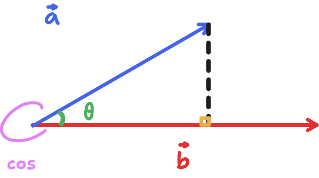

# 向量

## 定義

一個向量 $\vec{AB}$ 被定義為 $B - A$，也就是 $(B_x - A_x, B_y - A_y, B_z - A_z, \ldots)$。

所以向量也就是描述座標移動的數學表達。

## 直線上的一點

用向量可以定義出直線上的一點。可以想像成是從某一端點移動 $k$ 倍的 $\vec{AB}$，也就是：

$$A + k\vec{AB}$$

## 運算

### 負向量

負向量就是一個朝向相反的向量。

$$-\vec{a} = (-a_x, -a_y, -a_z, \ldots)$$

### 加法

向量加法就是把**兩個箭頭頭尾串在一起**。

$$\vec{a} + \vec{b} = (a_x + b_x, a_y + b_y, a_x + b_x, \ldots)$$

### 減法

向量減法可以看成是加上一個負向量。

$$\vec{a} - \vec{b} = \vec{a} + (-\vec{b}) = (a_x - b_x, a_y - b_y, a_z - b_z, \ldots)$$

### 純量乘法

若向量乘上一個常數就是純量乘法。

$$
k(a_x, a_y, a_z, \ldots) = (ka_x, ka_y, ka_z, \ldots)
$$

### 兩向量的夾角

把**向量的起點放於同一點**，那兩向量所構成的平面上就有兩向量的夾角。

### 內積

內積被定義為：兩個向量間**同方向的重疊程度**，而這可以用三角函數描述成：

$$\vec{a} \cdot \vec{b} = | \vec{a} | | \vec{b}| \cos \theta = (| \vec{a} | \cos \theta) | \vec{b} |$$

而內積可用於**向量是否垂直**。若 $\cos \theta = 0$，那 $\theta = 90\degree + 360\degree k (k \in \mathbb{Z})$，而這時兩向量的內積就會是 $0$。

這代表，若 $\vec{a} \cdot \vec{b} = 0 \Longrightarrow \theta = 90\degree$。

### 外積

TODO
## 投影

將 $\vec{a}$ 投影至 $\vec{b}$ 就是把 $\vec{a}$ 拆成由 $\vec{b}$ 和與 $\vec{b}$ 垂直的向量（可想像成是分力），而在 $\vec{b}$ 上的分力長度就是他的投影。

可以用三角函數描述成：

$$|\vec{a}| \cos\theta$$

而 $\theta$ 就是 $\vec{a}$ 與 $\vec{b}$ 的夾角。

## 列向量

把向量寫成直的就是列向量。

$$
(a_x, a_y, a_z, \ldots) = \begin{pmatrix}a_x\\a_y\\a_z\\ \vdots\end{pmatrix}
$$

通常在二維平面上，做矩陣乘法時常轉換向量： $(x, y) = \begin{pmatrix}x\\ y\end{pmatrix}$。

## 標準基底向量

把一個向量拆成 $x, y$ 兩個方向的分力 $\vec{e_x} = (1, 0), \vec{e_y} = (0, 1)$ 就是標準基底向量，而一個向量的分力可以寫成：

$$(x, y) = x\vec{e_x} + y\vec{e_y}$$