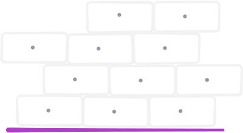
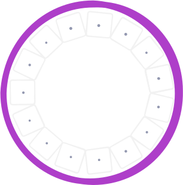
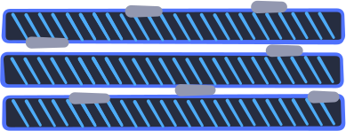
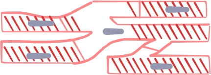
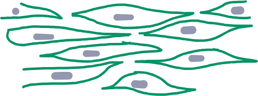

# 動物體的組織

回顧國中所學的構造層級：

```text
細胞 << 組織 << 器官 << 器官系統 << 個體
```

而組織是由「**細胞**」加上「**胞外間質**」組成。

::: info 什麼是胞外間質？

**胞外間質為細胞分泌的物質**。

主要由「蛋白多糖」、「彈性纖維」、「膠原纖維」構成。

但請注意，**「血漿」並非血球的分泌物**。

:::

## 上皮組織

位於體表與體內管腔內壁、黏膜等組織為上皮組織。

共有五種主要型態：

| 種類 | 單層扁平 | 多層扁平 | 單層柱狀 | 柱狀纖毛 | 單層立方 |
| --- | --- | --- | --- | --- | --- |
| 功能 | 物質交換（足夠薄） | 保護（可磨損） | 吸收 | 吸收 + 推動 | 分泌 |
| 位置 | 肺泡、微血管 | 皮膚、食道 | 腸胃內襯 | 氣管、輸卵管 | 腺體、腎小管、集尿管 |
| 圖示 |  |  |  |  |  |

::: info 什麼是腎小管、集尿管？

兩者都是腎臟內部構造，請見[此網站](https://www.ehanlin.com.tw/app/keyword/%E9%AB%98%E4%B8%AD/%E7%94%9F%E7%89%A9/%E8%85%8E%E5%B0%8F%E7%AE%A1.html)。

:::

::: info 圖示中、紫色部分是啥？

這是「**基底膜**」，一種特化的胞外間質。

其功能簡述如下：

1. 將上皮組織固定於疏鬆結締組織之上。
2. 作為屏障，防止惡性腫瘤細胞直接侵入其他組織。
3. 各種物質的交換場所。

:::

## 肌肉組織

肌肉組織由肌纖維組成。注意**肌纖維 = 肌細胞**。

| 型態 | 骨骼肌 | 心肌 | 平滑肌 |
| --- | --- | --- | --- |
| 圖示 |  |  |  |
| 特徵 | 細長 | 柱狀並有分支 | 紡錘狀 |
| 細胞核 | 「多」核，位於邊緣 | 單核，位於中央 | 單核，位於中央 |
| 橫紋 | 有 | 有 | 無（畢竟是平滑肌） |
| 可否用意識控制 | 可以 | 不行 | 不行 |
| 分布 | 附著於骨骼 | 心臟 | 內臟 |
| 收縮與持續性 | 快但易疲勞 | 慢但「最不易」疲勞 | 「最慢」，不易疲勞 |

::: info 不能被大腦控制的肌肉

這些肌肉又被稱為「**不隨意肌**」，與「隨意肌」相對。

這些肌肉**由交感神經（負責戰或逃反射）與副交感神經（負責休息與消化）控制**。

畢竟人不能控制心臟停跳一拍（？

:::

::: info 為何骨骼肌有多核？

骨骼機生長時，是由多個「肌母細胞」融合形成。

:::

::: info 為何肌肉會有橫紋？

肌纖維由肌原纖維組成，而肌原纖維由肌小節組成。


每一小節由 Z line 為分界，而在肌小節中央有粗絲（Thick filments），就是這些蛋白質使肌肉出現明帶（I bond）與暗帶（A bond）。

:::

## 結締組織

結締組織通常是**排列疏鬆、胞外間質多**的組織。用於填充不同組織之間的空間。

| 型態 | 軟骨 | 硬骨 | 脂肪 | 疏鬆 | 緻密 | 血液 |
| --- | --- | --- | --- | --- | --- | --- |
| 圖示 |  |  |  |  |  |  |
| 胞外間質成分 | 軟骨質 | 硬骨質（鈣 + 膠原蛋白） | 少，且細胞核在細胞邊緣 | 蛋白多醣 | 膠原蛋白 | 血漿（不由血球分泌） |
| 功能 | 減少關節摩擦 | 支撐身體 | 儲存能量，保護臟器 | 填充固定 | 防止拉散撕裂 | 運輸物質 |
| 分布 | 氣管、鼻翼、耳殼 | 骨頭 | 皮下、臟器 | 膜類組織 | 韌帶（骨骼與骨骼間）、肌腱（肌肉與骨骼間） | 血管 |

::: info 硬骨組織的細胞與哈氏管


此圖中的空腔是**哈氏管**，負責讓血管、神經、淋巴通過。

而硬骨組織中的細胞是紅色部分。

:::

## 神經組織

| 型態 | 神經細胞 | 神經膠細胞 |
| --- | --- | --- |
| 圖示 |  | 種類多 |
| 型態 | 由神經細胞本體 + 神經纖維組成。細胞本體為細胞核 + 臟器；神經纖維為樹突 + 軸突 | 數量，種類多 |
| 功能 | 樹突：接收訊息；軸突：傳遞訊息 | 協助神經元生長（星狀細胞）、加速傳遞（許旺細胞、寡突細胞）、防止病原體（微膠細胞） |

::: info 許旺細胞與寡突細胞差別


| 細胞 | 許旺細胞 | 寡突細胞 |
| --- | --- | --- |
| 分布 | 周圍神經 | 中樞神經 |
| 功能 | 加速神經訊息傳遞 | 加速神經訊息傳遞 |
| 型態 | 包覆單一軸突的一節髓鞘 | 包覆多個軸突的多節髓鞘 |

:::
