# 循環系統

## 不具循環系統的小生物

單細胞生物與簡單多細胞生物不具循環系統，其物質進出與內部移動方式為：

| 物質進出細胞 | 物質在細胞移動 |
| --- | --- |
| 擴散、主動運輸、胞吞胞吐 | 擴散、胞質循流 |

::: info 什麼是胞質循流？

目前學界尚未定論，通常認為是藉由ATP提供能量，使肌凝蛋白分子連接胞器沿著細胞骨架移動（Wikipedia）。

:::

## 一般循環系統

目前存在兩種循環模式：

| | 開放式循環 | 閉鎖式循環 |
| --- | --- | --- |
| 圖示 |  |  |
| 血管 | 只有動脈 -> 靜脈 | 動脈 -> 微血管 -> 靜脈 |
| 體液 | 血淋巴：血液 + 淋巴液 | 組織液 |
| 血壓 | 低、效率差 | 高，效率好 |
| 例子 | 節肢動物、軟體動物 | 脊髓動物、環節動物、烏賊、章魚 |

## 心血管循環系統

### 心臟



### 體循環與肺循環

1. 左體右肺（因為左心肌較厚，力量大，可以推至全身）。
2. 體循環：

```text
左心室 -> 主動脈 -> 小動脈 -> 組織微血管 -> 小靜脈 -> 上 / 下大靜脈 -> 右心房
```

3. 肺循環：

```text
右心房 -> 肺動脈 -> 肺小動脈 -> 肺泡微血管 -> 肺小靜脈 -> 肺靜脈 -> 左心房
```
