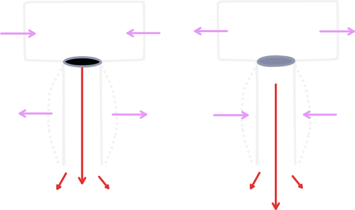

# 循環系統

## 不具循環系統的小生物

單細胞生物與簡單多細胞生物不具循環系統，其物質進出與內部移動方式為：

| 物質進出細胞 | 物質在細胞移動 |
| --- | --- |
| 擴散、主動運輸、胞吞胞吐 | 擴散、胞質循流 |

::: info 什麼是胞質循流？

目前學界尚未定論，通常認為是藉由ATP提供能量，使肌凝蛋白分子連接胞器沿著細胞骨架移動（Wikipedia）。

:::

## 一般循環系統

目前存在兩種循環模式：

| | 開放式循環 | 閉鎖式循環 |
| --- | --- | --- |
| 圖示 |  |  |
| 血管 | 只有動脈 -> 靜脈 | 動脈 -> 微血管 -> 靜脈 |
| 體液 | 血淋巴：血液 + 淋巴液 | 組織液 |
| 血壓 | 低、效率差 | 高，效率好 |
| 例子 | 節肢動物、軟體動物 | 脊髓動物、環節動物、烏賊、章魚 |

## 心血管循環系統

### 器官

#### 心臟


請注意是左體右肺（因為左心肌較厚，力量大，可以推至全身）。

---

#### 心搏

心搏由右心房上大靜脈基部的特化不隨意肌「節律點」「竇房結」自發產生神經電衝動，促使心肌收縮。


此處的 PQRST 皆有其成因：

| 波形標記 | 電流位置 | 結果 |
| --- | --- | --- |
| P | 心房 | 心房收縮 |
| Q | 心室中膈 | |
| R | 心室主要肌肉 | 心室收縮 |
| S | 心室末端機肉 | |
| T | 心室 | 心室舒張 |

---

#### 心音

心搏有兩聲心音，而這兩聲分別為血液撞擊**房室瓣**與**半月瓣**形成的。


因此，兩聲心音分別是：

1. **房室瓣關閉**、**低又長**的血液衝擊聲。（QRS）
2. **半月瓣關閉**、**高又短**的血液衝擊聲。（T）

::: details CG 心搏


:::

::: details 完整心搏示意圖


:::

---

#### 血管

動脈與靜脈有四層構造：

```text
結締組織 -> 平滑肌 -> 彈性纖維 -> 基底膜 + 單層扁平上皮組織
```

而不同血管間的差異表如下：

| | 動脈 | 微血管 | 靜脈 |
| --- | --- | --- | --- |
| 管徑 | 中 | 小（一個紅血球） | 大 |
| 管壁 | 厚 | 薄（物質交換） | 中 |
| 彈性 | 大 | 小 | 中 |
| 總截面積 | 小 | 大 | 中 |
| 流速 | 大 | 小 | 中 |
| 血壓 | 大 | 中 | 小 |
| 動力 | 心臟收縮 + 管壁回彈力 | 動靜脈壓力差 | 骨骼肌收縮 + 吸氣負壓 + 重力 + 瓣膜 |

::: info 總截面積與流速的關係

由於 $流量 = 總截面積 \times 流速$，因此可知 $流速 \propto \frac{1}{總截面積}$。

:::

::: info 動脈的動力



:::

::: info 吸氣負壓

根據 $PV = nRT$，吸氣時，胸腔空間變大，又因為 $V \propto \frac{1}{P}$，因此相較於腹腔壓力下降。

因此，吸氣時靜脈血液會從腹腔往上流動。

:::

::: info 微血管血流調節

微血管並非隨時都有血液經過，主要由「微血管前」的「括約肌」控制。

:::

---

#### 血壓

1. 收縮壓：心室收縮對動脈壁產生的壓力。
2. 舒張壓：心室舒張對動脈壁產生的壓力。
3. $血壓 = 心輸出量 \times 血管阻力$。

---

#### 血液

全血 + 抗凝血劑離心後可得：

```text
血漿 [ 水 90% | 血漿蛋白 8% + 其他物質 2% ] 55%
+
血液 [ 紅血球 最多 | 血小板 中等 | 白血球 最少 ] 45%
```

而全血不加入抗凝血劑離心後可得：

```text
血餅 [血球 + 凝血蛋白] + 血清 [血漿 - 凝血蛋白]
```

::: info 血漿蛋白

血漿蛋白中還可再分為：

| 蛋白 | 功能 |
| --- | --- |
| 血蛋白 | 滲透壓恆定 |
| 血纖維蛋白 | 凝血 |
| 脂蛋白 | 脂質運輸 |
| 補體 + 抗體 | 免疫 |
| 其他蛋白質 | 酸鹼緩衝 |
| 激素 + 酵素 | |

:::

---

#### 血球

| | 紅血球 | 白血球 | 血小板 |
| --- | --- | --- | --- |
| 體積 | 中 | 大 | 小 |
| 細胞核 | 成熟無 | 有 | 成熟無 |
| 數量 | 最多 | 少 | 中 |
| 壽命 | 120d | depends | 12d |

::: info 血小板的誕生

血小板由「巨核細胞」的細胞質崩落形成。


:::

---

### 循環

#### 體循環

```text
左心室 -> 主動脈 -> 小動脈 -> 組織微血管 -> 小靜脈 -> 上 / 下大靜脈 -> 右心房
```

#### 肺循環

```text
右心房 -> 肺動脈 -> 肺小動脈 -> 肺泡微血管 -> 肺小靜脈 -> 肺靜脈 -> 左心房
```

#### 冠狀循環

```text
左心室 -> 主動脈基部 -> 冠狀動脈 -> 小動脈 -> 心肌微血管 -> 小靜脈 -> 冠狀靜脈 -> 右心房
```

::: info 冠狀動脈的開口

冠狀動脈的開口在主動脈基部，並且半月瓣會週期的擋住此開口。


:::

#### 肝門循環

```text
腸胃胰脾微血管 -> 肝門靜脈 -> 肝臟微血管 -> 肝靜脈 -> 下腔靜脈 -> 右心房
```

::: info 為何要存在肝門靜脈？


:::
