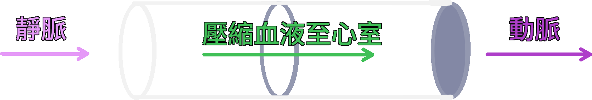

# 循環系統

## 不具循環系統的小生物

單細胞生物與簡單多細胞生物不具循環系統，其物質進出與內部移動方式為：

| 物質進出細胞 | 物質在細胞移動 |
| --- | --- |
| 擴散、主動運輸、胞吞胞吐 | 擴散、胞質循流 |

::: info 什麼是胞質循流？

目前學界尚未定論，通常認為是藉由ATP提供能量，使肌凝蛋白分子連接胞器沿著細胞骨架移動（Wikipedia）。

:::

## 一般循環系統

目前存在兩種循環模式：

| | 開放式循環 | 閉鎖式循環 |
| --- | --- | --- |
| 圖示 |  |  |
| 血管 | 只有動脈 -> 靜脈 | 動脈 -> 微血管 -> 靜脈 |
| 體液 | 血淋巴：血液 + 淋巴液 | 組織液 |
| 血壓 | 低、效率差 | 高，效率好 |
| 例子 | 節肢動物、軟體動物 | 脊髓動物、環節動物、烏賊、章魚 |

## 心血管循環系統

### 器官

#### 心臟



請注意是左體右肺（因為左心肌較厚，力量大，可以推至全身）。

---

#### 心搏

心搏由右心房上大靜脈基部的特化不隨意肌「節律點」「竇房結」自發產生神經電衝動，促使心肌收縮。


此處的 PQRST 皆有其成因：

| 波形標記 | 電流位置 | 結果 |
| --- | --- | --- |
| P | 心房 | 心房收縮 |
| Q | 心室中膈 | |
| R | 心室主要肌肉 | 心室收縮 |
| S | 心室末端機肉 | |
| T | 心室 | 心室舒張 |

---

#### 心音

心搏有兩聲心音，而這兩聲分別為血液撞擊**房室瓣**與**半月瓣**形成的。



因此，兩聲心音分別是：

1. **房室瓣關閉**、**低又長**的血液衝擊聲。（QRS）
2. **半月瓣關閉**、**高又短**的血液衝擊聲。（T）

::: details CG 心搏


:::

::: details 完整心搏示意圖



:::

#### 血管

### 循環

#### 體循環

```text
左心室 -> 主動脈 -> 小動脈 -> 組織微血管 -> 小靜脈 -> 上 / 下大靜脈 -> 右心房
```

#### 肺循環

```text
右心房 -> 肺動脈 -> 肺小動脈 -> 肺泡微血管 -> 肺小靜脈 -> 肺靜脈 -> 左心房
```

#### 冠狀循環

```text
左心室 -> 主動脈基部 -> 冠狀動脈 -> 小動脈 -> 心肌微血管 -> 小靜脈 -> 冠狀靜脈 -> 右心房
```

::: info 冠狀動脈的開口

冠狀動脈的開口在主動脈基部，並且半月瓣會週期的擋住此開口。



:::

#### 肝門循環

```text
腸胃胰脾微血管 -> 肝門靜脈 -> 肝臟微血管 -> 肝靜脈 -> 下腔靜脈 -> 右心房
```

::: info 為何要存在肝門靜脈？



:::
