# DNA 複製

::: tip 重點整理

- DNA 複製為 **半保留複製**。
- DNA 解旋酶、聚合酶會沿模板股的 $5' \rightarrow 3'$ 移動。
- 使用 $\ce{dNTPs}$ 提供原料與能量。

:::

## 原料

- 原始 DNA 股$\times 2$。
- 三磷酸去氧核糖核苷酸（$\ce{dNTPs}$）。
- 酵素：DNA 解旋酶、DNA 聚合酶、DNA 連接酶。

::: info 為何不是單磷酸去氧核糖核苷酸（$\ce{dNMPs}$）？

由於 DNA 複製需要能量，不如直接使用 **DNA 內部儲存的能量比較方便**，而不是再去使用 $\ce{ATP}$ 做為能源。因此需要磷酸鍵，故而使用三個磷酸的去氧核糖核苷酸。

:::

## 圖解

- 每次複製會由新股與舊股合併，稱作**半保留複製**。
- 當作模板的藍色、白色股為**舊股（模板股）**，旁邊的橘色、綠色與黃色股為**新股（領先股）**。
- DNA 解旋酶、聚合酶會沿模板股的 $5' \rightarrow 3'$ 移動。
