# 轉錄與轉譯

::: tip 重點整理

**轉錄是將 DNA 的一股轉成 mRNA 傳遞，轉譯是將 mRNA 轉成胺基酸表現基因**。

轉錄：

- 使用**三磷酸核糖核苷酸**提供 RNA 原料與能量。
- 產出對應之 mRNA，滿足轉換表：

| DNA 鹼基 | RNA 鹼基 |
| --- | --- |
| A | ***U** |
| T | A |
| C | G |
| G | C |

轉譯：

- 發生於核糖體中。
- 起始密碼子只有 $\ce{AUG}$。
- 終止密碼子有 $\ce{UGA, UAA, UAG}$。
- **起始密碼子會對應到胺基酸，但終止密碼子不會**。

:::

## 原料

### 轉錄

- DNA 模板股$\times 1$。
- **三磷酸核糖核苷酸**。
- RNA 聚合酶。

### 轉譯

- mRNA$\times 1$。
- 胺基酸（由 tRNA 運送）。
- **核糖體**大小子單元。

## 圖解

- RNA 聚合酶同時解旋並使鹼基互補產生 mRNA。

::: tip 名詞定義

- 密碼子：一組**可以轉譯成胺基酸的含氮鹼基序列**，在人體中**三個鹼基一組**為一個密碼子。
- 補密碼（反密碼子）：tRNA 上的含氮鹼基序列，可**在轉譯時與 mRNA 上的密碼子結合**，順便帶來胺基酸。
- 起始密碼子：一段基因的**起始鹼基序列**。
- 終止密碼子：一段基因的**結尾鹼基序列**

:::

- 轉錄產生之 mRNA 經由核糖體，產出對應之多肽鏈。

::: warning 注意

- 起始密碼子只有 $\ce{AUG}$。
- 終止密碼子有 $\ce{UGA, UAA, UAG}$。
- **起始密碼子會對應到胺基酸，但終止密碼子不會**。

:::
