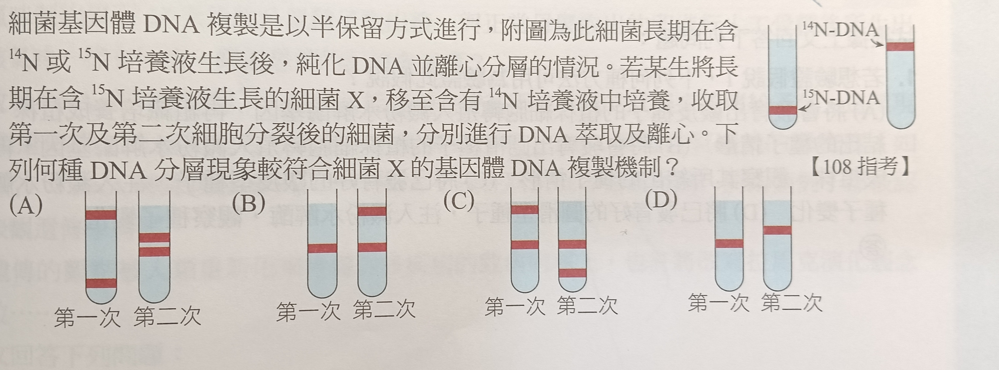

# bio-002

## 題目

## 解法

::: details

[DNA 複製](../DNA複製)為半保留複製，因此：

| 項目 | 初始細菌 | 第一次複製 | 第二次複製 |
| --- | --- | --- | --- |
| $\ce{^{14}N} - \ce{^{15}N}$ | 只有 $\ce{^{15}N}$ | 全部都是 $\ce{^{14}N} - \ce{^{15}N}$ | $\ce{^{14}N} - \ce{^{15}N}$ 一半，$\ce{^{14}N} - \ce{^{14}N}$ 一半（因為半保留複製 |

所以，第一次應為一槓，第二次為兩槓，故選 (B)。

:::
