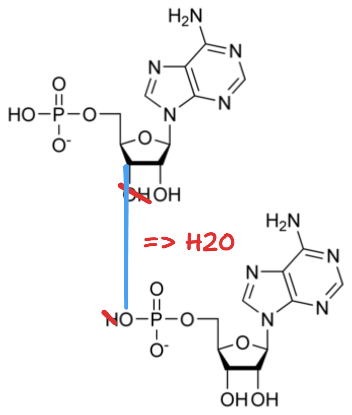

# DNA 和 RNA

::: tip 重點整理

- $$\frac{A + G}{C + T} = 1$$
- DNA聚合是 $3'$ 碳丟 $\ce{OH}$，$5'$ 碳丟 $\ce{H}$，聚合會**脫水**。
- 一條 DNA 與 RNA 鏈有分為 $5'$ 端與 $3'$ 端，**$5'$ 端為始、 $3'$ 端為尾**。
- **DNA 經過轉錄，會產生 RNA 傳遞訊息**。

:::

## 理論歷史

- **查加夫**法則 (1940)：
$$\frac{\text{Purines}}{\text{Pyrimidines}} = \frac{A + G}{C + T} = 1 = \text{a single DNA}$$
- 富蘭克林 DNA 分子 X 光照射實驗 (1952)。
- 華生、克里克，雙股螺旋結構。

## 比較

| 項目 | DNA (dNMPs) | RNA (NMPs) |
| --- | --- | --- |
| 五碳糖 | C2 接 H | C2 接 OH |
| 含氮鹼基 | A, T, C, G | A, U, C, G |
| 細胞中位置 | 細胞核、葉綠體基質、粒線體基質 | 細胞核、核糖體、粗糙內質網、葉綠體基質、粒線體基質 |

::: tip 請記得

- 在 RNA 中， T 被替換成 U。
- AT 以**兩氫鍵**連接； CG 以**三氫鍵**連接。

:::

## 核苷酸聚合

因此聚合時會脫水。

也因為這樣，一條 DNA 與 RNA 鏈有分為 $5'$ 端與 $3'$ 端，因為 $5'$ 碳的磷酸根完好、$3'$ 碳的 $\ce{OH}$ 完好。

## 雙股螺旋結構

::: tip 注意

這時**兩股互相平行且方向相反**，畢竟要使鹼基互相配對。

:::

## 兩者關係

**DNA 經過轉錄，會產生 RNA 傳遞訊息**。
