# 染色質與染色體

## 組成

- 染色質：DNA + 蛋白質。
- 染色體：棒狀的染色質。

::: tip 從核苷酸到染色體

1. 核苷酸：五碳糖 + 含氮鹼基 + 磷酸根
2. DNA / RNA：多個核苷酸聚合。
3. 染色質：DNA + 蛋白質。
4. 染色體：棒狀染色質。

:::

## 染色體學說

### 提出者

薩登（Sutton）、包法利（Boveri）

## 觀點

遺傳物質應位在染色體上。

::: info 等位基因與染色體學說

薩登與包法利並不知道何謂基因，因此「**等位基因在同源染色體上**」是後人加上去的。

:::

## 推論簡述

在尋找遺傳因子的所在時，大致是用以下的過程找到的。

### 精卵構造

研究精子與卵子時，精子小，卵子大，但兩者皆有**細胞核**，且細胞核也足夠大來裝載所有遺傳因子。

### 精卵貢獻

研究發現精子與卵子的貢獻相當。

### 配子形成

與孟德爾遺傳學說比對，會發現：

因此，兩人推論遺傳因子應位於染色體上。
