# 膠體溶液

::: tip 重點整理

- 名詞轉換

| 原名 | 溶質 | 溶劑 | 溶液 |
| --- | --- | --- | --- |
| 新名 | 分散質 | 分散媒、分散介質 | 分散系 |

- 具廷得耳效應。
- 有布朗運動。
- 膠粒易吸附電荷。
- 凝聚可通電或加入相反電荷電解質。

:::

## 性質

- 溶質分散於溶液中，故：

::: tip 名詞定義

| 原名 | 溶質 | 溶劑 | 溶液 |
| --- | --- | --- | --- |
| 新名 | 分散質 | 分散媒、分散介質 | 分散系 |

:::

- 具有**廷得耳效應**。
- 發生**布朗運動**。
- 分散質易吸附電荷。

## 廷得耳（丁達爾）效應

當光線進入粒徑較大的溶質（分散質），容易發生散射而在溶液（分散系）中出現光柱。

## 布朗運動

分散系中的**分散質、分散媒互相碰撞**而導致分散質不停做**無規則快速運動**，即為布朗運動。

## 分散與凝聚現象

### 膠粒

以氫氧化鐵為例，一顆膠粒可以表示如下：

$$\ce{\{[Fe(OH)3]m . nFeO+ . (n - x)Cl+\}^{x-} . x Cl+}$$

也就是：

#### 膠核

膠核就是此溶液的分散質物質，例如氫氧化鐵膠體溶液的氫氧化鐵。

#### 吸附層

膠核小，因此**表面積大，容易緊緊吸附電荷**。例如氫氧化鐵膠體溶液的膠粒上，容易吸附 $\ce{FeO+}$，並由於帶正電吸附 $\ce{Cl-}$。

::: tip 膠核與吸附離子的關係

通常膠核容易吸附與自身成分相仿，膠體溶液中過量的離子，但並不是絕對。

下表是常見膠體容易吸附的離子：

| 膠體 | 容易吸附的離子 | 膠體帶電 |
| ---------------------------- | -------------------------- | --- |
| $\ce{Fe(OH)3}$ | $\ce{Fe^{3+}}$ | 正電 |
| $\ce{Al(OH)3}$ | $\ce{Al^{3+}}$ | 正電 |
| $\ce{AgI}$，若 $\ce{AgNO3}$ 過量 | $\ce{Ag+}$ | 正電 |
| $\ce{AgI}$，若 $\ce{KI}$ 過量 | $\ce{I^-}$ | 負電 |
| $\ce{As2S3}$ | $\ce{S^{2-}}$ 或 $\ce{HS^-}$ | 負電 |

:::

#### 擴散層

溶液必定電中性，因此外圍會有粒子靠近來中和電性。例如氫氧化鐵膠體溶液的膠粒的擴散層布滿 $\ce{Cl-}$。

### 分散

由於膠粒上常吸附電荷，因此同極相斥，容易將分散質分散在分散系裡。

### 凝聚

若要使膠體溶液凝聚，有兩種作法：

1. 通電：由於膠粒帶電，透過通電可以使之移動並靠近電極，最後析出。
2. 加入電解質：以氫氧化鐵膠體溶液為例，由於其膠粒帶正電，因此加入陰離子電解質便可以中和電性，使之凝聚。

::: tip 電解質離子價數與凝聚關係

若電解質離子價數越高（容易帶更多相反電荷），更能使膠粒凝聚。

:::
