# 化學電池

化學電池，是利用金屬活性來促使電子流動的裝置。

## 結構

常考的化學電池通常由金屬片，電解質水溶液，鹽橋組成。

## 化學式

由於 Mg 活性大，容易失去電子，因此會被氧化。

負極半反應式為：

$$
\ce{Mg -> Mg^{2+} + 2e-}
$$

而當 Cu 接收電子後，正極水溶液中的 $\ce{Cu^{2+}}$ 離子會被吸引。

正極半反應式為：

$$
\ce{Cu^{2+} + 2e- -> Cu}
$$

合併後的全反應式為：

$$
\ce{Mg + Cu^{2+} -> Mg^{2+} + Cu}
$$

## 電子移動與電流

由於 Mg 易失去電子，因此電子由高活性金屬片流向低活性金屬片，也就是從負極流向正極。

而電流方向與電子相反，故電流由低活性金屬片流向高活性金屬片，也就是從正極流向負極。

## 鹽橋

由於反應中，負極會產生 $\ce{Mg^{2+}}$，需要鹽橋中的 $\ce{NO3-}$ 中和電性。

而正極會消耗 $\ce{Cu^{2+}}$，需要鹽橋中的 $\ce{K+}$ 中和電性。
