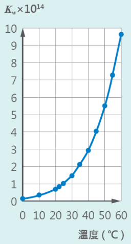

# 酸鹼度

## 離子積常數

水是極弱的電解質，會解離出微量的 $\ce{[H+]}$ 與 $\ce{[OH-]}$，而這兩濃度相乘的值就是離子積常數 $\ce{K_w}$。

由於水的自解離會吸熱，因此溫度越高越能促使解離發生，使 $\ce{K_w}$ 與溫度有關。通常 $25\degree \text{C}$ 時 $\ce{K_w} = 1\times 10^{-14}$。

## pH 與 pOH

$$
\ce{pH = -\log [H+]}
$$
$$
\ce{pOH = -\log [OH-]}
$$

這是 pH 與 pOH 的公式，可以描述溶液內的 $\ce{[H+], [OH-]}$ 濃度。

## 中性，酸性與鹼性

中性，酸性與鹼性描述的是 $\ce{[H+], [OH-]}$ 的濃度大小關係。

| 酸性 | 中性 | 鹼性 |
| --- | --- | --- |
| $\ce{[H+] > [OH-]}$ | $\ce{[H+] = [OH-]}$ | $\ce{[H+] < [OH-]}$ |

而 **pH 與 pOH 值並不能完全決定酸性或鹼性**，必須藉由 $\ce{K_w}$ 來確定中性的 $\ce{[H+], [OH-]}$ 濃度，才能確定中性的 $\ce{pH, pOH}$。

::: info 為何 pH 與 pOH 值不能決定酸性或鹼性？

假設一杯水 $\ce{100 \degree C}$，這時的 $K_w \approx 5.5 \times 10^{-13}$。

問：$\ce{pH = 7}$ 的液體是酸、鹼還是中性？

藉由公式，可知 $\ce{7 = -\log[H+], [H+] = 10^{-7}}$。
這時的 $\ce{[H+][OH-] = K_w \approx 5.5 \times 10^{-13}}$，故 $\ce{[OH-] \approx 5.5 \times 10^{-6}}$

請觀察 $\ce{[H+], [OH-]}$，是不是 $\ce{[H+] > [OH-]}$？

故在 $\ce{100 \degree C}$ 時，$\ce{pH = 7}$ 的液體是酸性。

:::
