# 大氣與海洋形成

## 簡圖

## 原始大氣

1. **第一大氣（原始大氣）**：主要為太陽星雲中的 $\ce{H_2}$、$\ce{He}$。由於早期地球質量較小、溫度高，加上太陽風強烈，這些較輕的氣體大多逃逸至太空。
2. **第二大氣（次生大氣）**：地球內部分異與火山活動旺盛，火山逸氣釋出大量 $\ce{H_2O(g)}$、$\ce{CO_2}$、$\ce{N_2}$、$\ce{SO_2}$，另含少量 $\ce{CH_4}$、$\ce{NH_3}$、$\ce{H_2}$ 等氣體。

## 海洋形成

### 水的來源

由於隕石撞擊減少，地表逐漸冷卻，因此水開始形成。

1. 火山逸出的水蒸氣凝結 => 長期降雨。
2. 含水小行星與隕石帶來的水。

這些水在低窪處形成「**原始海洋**」。

### 鹽類的來源

1. $\ce{CO_2}$、$\ce{SO_2}$ 等氣體溶入雨水和海水。
2. 陸地岩石經河流沖刷 => 陽離子。
3. 火山噴發 => 陰離子。

| 離子 | 例子 |
| --- | --- |
| 陽離子 | $\ce{Na+}$、$\ce{Mg^2+}$、$\ce{Ca^2+}$、$\ce{K+}$ |
| 陰離子 | $\ce{Cl-}$、$\ce{SO4^2-}$、$\ce{HCO3-}$ |

## 大氣漸變

### 氧氣的出現與累積

早期氧氣有兩個主要來源：

1. **水分子的光解**：$\ce{2H2O ->[紫外線] -> 2H2 + O2}$
2. **生物的光合作用**：$\ce{6CO2 + 6H2O ->[光能] C6H12O6 + 6O2}$

常見的氧氣-時間圖如下：

（[來源：2009-05-01，地球大氣組成的演化，Han-Chiang Chou](https://mynotes.org/earth/?p=2489)）

可注意到，在 2.45B ~ 0.85B 年之間，氧氣量一直維持在低水平。

::: info 延遲氧氣累積的原因

剛產生的氧氣不會立刻累積於大氣，而會先氧化海水中的還原性物質，例如亞鐵離子：

$$
\ce{4Fe^2+ + O2 + 6H2O -> 2Fe2O3 + 12H+}
$$

氧氣也會氧化火山氣體與地表岩石。當這些「氧氣消耗槽」逐漸飽和後，約在 **24 億年前**發生大氧化事件，大氣中的 $\ce{O_2}$ 才開始顯著累積。

:::

### 臭氧層形成

大氣中的氧分子受紫外線照射後產生氧原子，氧原子再與氧分子結合形成臭氧：

$$
\ce{O2 ->[UV] 2O}
$$

$$
\ce{O + O2 -> O3}
$$

臭氧層可吸收大部分有害紫外線，降低陸地環境的輻射威脅，為生物登陸創造條件。

### 現代大氣的建立

- $\ce{H_2}$、$\ce{He}$：質量小，逐漸逃逸至太空。
- $\ce{H_2O}$：地表冷卻後凝結並進入海洋，使大氣中的含量下降。
- $\ce{CO_2}$：溶入海洋、形成碳酸鹽岩，亦被光合作用消耗。
- $\ce{SO_2}$：溶於水並形成硫酸鹽礦物，含量下降。
- $\ce{CH_4}$、$\ce{NH_3}$：被紫外線分解或被氧化，逐漸減少。
- $\ce{N_2}$：化學性質較不活潑，逐漸累積成為現代大氣的主要成分。
- $\ce{O_2}$：由產氧光合作用持續補充，最終成為現代大氣的第二大成分。

## 海洋漸變

光合作用生物使海水中的溶氧增加，但早期產生的氧會先與海水中的 $\ce{Fe^2+}$ 反應，生成難溶的三價鐵氧化物並沉積，形成**條帶狀鐵礦**。這類岩層是早期海洋開始含氧的重要證據。

當海水中的還原性物質逐漸被氧化後，氧氣才更容易逸散並累積於大氣。海洋與大氣因此互相影響：

$$
\text{產氧光合作用}\rightarrow\text{海洋含氧量上升}\rightarrow\text{鐵氧化沉積}\rightarrow\text{大氣氧氣累積}\rightarrow\text{臭氧層形成}
$$

::: info 重點時間順序
第一大氣逸散 $\rightarrow$ 火山逸氣形成第二大氣 $\rightarrow$ 地表冷卻、降雨形成海洋 $\rightarrow$ 藍綠菌行光合作用 $\rightarrow$ 海中鐵先被氧化 $\rightarrow$ 大氣氧氣累積 $\rightarrow$ 臭氧層形成。
:::
