# 弧度

## 介紹

弧度是表示角的另一種形式，又稱為「弳」「$\text{rad}$」。

弧度的定義為「弧長與半徑的比值」，也就是下圖：

而又可與角度換算如下:

$$
\pi \text{ rad is } 180\degree
$$

::: info 證明

$$
\begin{aligned}
\text{Circumference} &= \text{Circumference} \\
2r\pi &= r\theta\\
2\pi &= \theta\\
\end{aligned}
$$

一個圓是 $2\pi \text{ rad}$，也是 $360\degree$，所以 $\pi \text{ rad}$ 就是 $180\degree$。

:::

## 分與秒

$1 \text{ rad } = 60' = 3600''$。

## 弧長公式與面積公式

把角度制的 $\frac{\theta}{360\degree}$ 轉成圓周長與弧長的比值，就是這些公式的由來。

### 弧長公式

$$
\begin{aligned}
2\pi r \times \frac{\theta}{2\pi} = r\theta
\end{aligned}
$$

### 面積公式

$$
\begin{aligned}
\pi r^2 \times \frac{\theta}{2\pi} = \frac{r^2\theta}{2}
\end{aligned}
$$
