# math-001

## 題目

現實生活中，三角測量所應用的領域廣泛，以「航海」為例，三角測量可用來計算海上目標物在航行期間難以實際測量的數據。如下圖，有一筆直東西向海岸線（以上方為正北方），北方為大海，岸邊有兩座觀測站 $A$、$B$，兩觀測站相距 $9$ 公里。

今有一艘漁船於海上航行，全程固定朝某一方位前進，航行期間，觀測站對漁船方位進行兩次測量。

第一次觀測時，$A$、$B$ 觀測站測得漁船方位分別為東 $30\degree$ 北、正北方。

第二次觀測時，$A$、$B$ 觀測站測得漁船方位分別為東 $75\degree$ 北、北 $45\degree$ 西。

若想根據以上資料求得漁船的前進方向及距離，試回答以下問題：

（1）第一次觀測時，漁船與 $A$ 觀測站間的距離為多少公里？
（2）若第二次觀測時，「$A$ 觀測站與漁船連線」及「漁船前進路線」所夾的角為 $\theta$，試求 $\theta$。
（3）在兩次觀測的間隔期間，漁船往什麼方位前進？前進了多少公里？

## 解法

作圖。

::: details (1)

根據 $30-60-90$ 度三角形比例 $1 : \sqrt 3 : 2$ 可知 $\overline{P_1A} = 6\sqrt 3$。

:::

::: details (3)

看到 $\triangle AP_2B$，發現可用正弦定理
$$\frac{9}{\sin 60\degree}=\frac{\overline{AP_2}}{\sin 45\degree}
$$
求出 $\overline{AP_2}$，再看到 $\triangle AP_1P_2$，可使用餘弦定理
$$
\overline{P_1P_2}^2=\overline{AP_2}^2 + \overline{BP_1}^2-2\overline{AP_2}\overline{BP_1}\cos 45\degree
$$
求出 $\overline{P_1P_2}$。

經過計算，$\overline{AP_2}=3\sqrt 6$，$\overline{P_1P_2}=3\sqrt 6$。

發現此時 $\triangle AP_1P_2$ 是一個 $1:1:\sqrt 2$ 三角形，故 $\angle P_2P_1A = 45 \degree$。

因此答案為：往西 $15\degree$ 北前進 $3 \sqrt 6$ 公里。

:::

::: details (2)

根據 (3)，$\theta = 90\degree$。

:::
