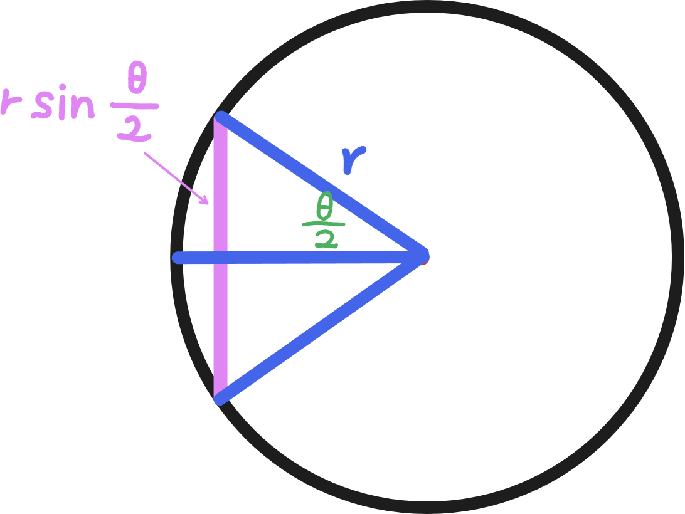
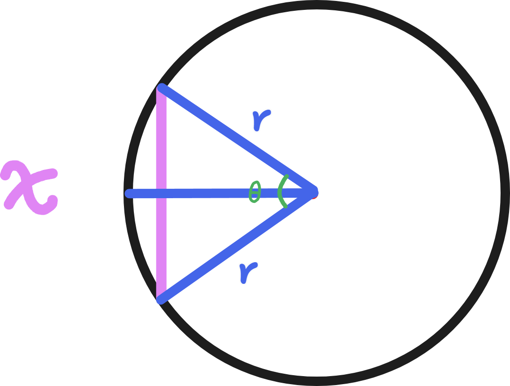

# 三角函數

## 定義

## 正弦

## 餘弦

## 應用

### 弦長

從弦做中垂線過圓心可知：

弦長 $= 2r \sin\frac{\theta}{2}$

由餘弦定理可知：

$$
\begin{aligned}
x^2 &= r^2 + r^2 - 2\times r\times r \times \cos \theta \\

x^2 &= 2r^2 - 2r^2\cos\theta \\

x &= \sqrt{2r^2(1-\cos\theta)} \\

x &= r\sqrt{2 - 2\cos\theta}
\end{aligned}
$$