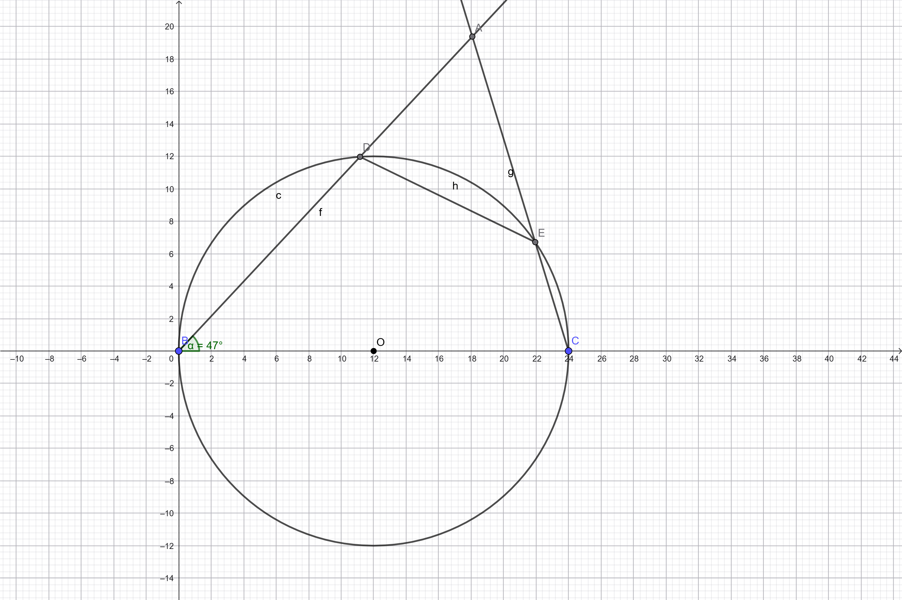

# TRML 2019 個人賽

## I1

> **[題目]**
> 若 $x$ 的二次方程式 $9x^2-3(1+a)x+a=0$ 的兩根為 $\sin\theta$、$\cos\theta$，則 $a^2=?$

若方程式兩根為 $\sin\theta$、$\cos\theta$，可以設方程式為 $k(x - \sin\theta)(x-\cos\theta)=0$。展開後對應如下：

$$
\begin{aligned}
k(x - \sin\theta)(x-\cos\theta)
&= kx^2 - k(\sin\theta + \cos\theta) + k\sin\theta\cos\theta
\end{aligned}
$$

由於原方程式 $9x^2-3(1+a)x+a=0$，$x^2$ 系數為 $9$，因此 $k = 9$ 帶入上式：

$$
\begin{aligned}
9x^2 - 9(\sin\theta + \cos\theta) + 9\sin\theta\cos\theta
\end{aligned}
$$

這時每項係數一一對應可知：

$$
\begin{cases}
-3(1+a) = -9(\sin\theta + \cos\theta) \\
a = 9\sin\theta\cos\theta
\end{cases}
$$

化簡可得：

$$
\begin{cases}
\sin\theta + \cos\theta = \frac{a + 1}{3}\\
a = 9\sin\theta\cos\theta
\end{cases}
$$

將第一式平方可得：

$$
\begin{aligned}
(\sin\theta + \cos\theta)^2
&= \sin^2\theta + \cos^2\theta + 2\sin\theta\cos\theta \\
(\frac{a + 1}{3})^2
&= 1 + \frac{2}{9}a
\end{aligned}
$$

化簡可得：

$$a^2 = 8$$

## I2

> **[題目]**
> 若 $t$ 為大於 $1$ 的實數,則 $\frac{t^4}{t^2 - 1}$ 的最小值為？

**[代數解]**

將 $t^4, t^2$ 代元變成 $x^2, x$， 因此原式轉為：

$$\min \frac{x^2}{x - 1} (x \in \mathbb{R} \wedge x > 1)$$

**注意到**，底下有 $x - 1$，那上面的 $x^2$ 可以看成 $[(x - 1) + 1]^2$。原式轉為：

$$\frac{[(x - 1) + 1]}{x - 1} = \frac{(x - 1)^2 + 1^2 + 2 (x - 1)}{x - 1} = (x - 1) + \frac{1}{x - 1} + 2$$

**注意到**，可以把 $x - 1$ 代元變成 $k$，於是原式轉為：

$$k + \frac{1}{k} - 2$$

而根據**算幾不等式**，可知：

$$\frac{k + \frac{1}{k}}{2} \ge \sqrt{k \times \frac{1}{k}}$$

因此：

$$\min{k + \frac{1}{k}} = 2 \Longrightarrow \min{k + \frac{1}{k} + 2} = 4$$

**[微分解]**

將 $t^4, t^2$ 代元變成 $x^2, x$， 因此原式轉為：

$$\min \frac{x^2}{x - 1} (x \in \mathbb{R} \wedge x > 1)$$

使用商數微分，也就是：

$$(\frac{u}{v})' = \frac{u'v - uv'}{v^2}$$

令 $f(x) = \frac{x^2}{x - 1} $，則：

$$
\begin{aligned}
f'(x)
&= \frac{(x^2)'(x - 1) - (x^2)(x - 1)'}{(x - 1)^2} \\
&= \frac{(2x)(x - 1) - (x^2)(1)}{(x - 1)^2} \\
&= \frac{2x^2 - 2x - x^2}{(x - 1)^2} \\
&= \frac{x^2 - 2x}{(x - 1)^2} \\
&= \frac{x(x - 2)}{(x - 1)^2}
\end{aligned}
$$

再來找 $f'(x) = 0$ 的 $x$，發現 $(x - 1)^2$ 必 $\ge 0$，所以只看 $x(x - 2) = 0$。

這時 $x = 0 \vee 2$，但由於題目限制，因此 $x = 2$，帶回原式：

$$f(2) = \frac{2^2}{x-1} = 4$$

## I3

三角形 $ABC$ 中，$\angle A=60\degree, B=47\degree$，且 $\overline{BC}=24$。若以 $\overline{BC}$ 為直徑作圓，交 $\overline{AB}$ 於 $D$、交 $\overline{AC}$ 於 $E$，則 $\overline{DE}=?$

做圖可知，

$\overline{CD}$ 相連後，$\angle BDC = 90\degree$，而 $\angle DCA = 30\degree$。

因此，優弧 $\overset{\frown}{DE}$ 的圓心角就是 $2\angle DCA = 60\degree$。

由於 $\overline{OD} = \overline{OE} = 2r$，因此三角形 $DOE$ 會是**正三角形**，因此 $\overline{DE} = r = 12$。

## I4

若七位數 $108\underline{abcd}$ 可以被 $2, 3, 5, 7, 11$ 整除，試求 $\max \underline{abcd}$？

由於此數可被多數整除，因此必定能被 $\operatorname{lcm}(2, 3, 5, 7, 11) = 2310$ 整除，而滿足 $1080000 \le \underline{abcd} < 1090000 \wedge 2310 \mid \underline{abcd}$ 的最大數就是 $1088010$（可由 $2310 \times \lfloor\frac{1090000}{2310}\rfloor$ 得知）。故 $\max \underline{abcd} = 8010$。
